echo " 
# CyberwatchV1B
The Cyberwatch is an extensible smartwatch built from scratch, targeting ESP32 hardware. It's current version is V1B.
Cyberwatch runs **Cyan**, a small operating system written in C with an embedded Lua runtime for app handling. Cyan is platform agnostic and can run on the watch and as a native desktop application, so the interface can be developed faster, without hardware in the loop by utilising [Clay](<https://github.com/nicbarker/clay>), a lightweight single header UI layout library. Apps are loaded at runtime from an SD card. 
Clay produces layout commands that are
consumed by either an ST7789V2 display handler on hardware or by SDL on a desktop machine. 
Cyan exposes hardware through a service architecture - a registry of
capabilities that apps and core tabs request as needed and can poll availability of arbitrarily. More info can be found with the [Word doc](<docs\Cyberwatch.docx>).

### Major Features
- Lua App Handling
- Watch-face
- Timer
- Stopwatch
- Remote Shell
- Settings

### Instillation
use `git clone --recurse-submodules https://github.com/ttankbuster/CyberwatchV1B.git` for installation, this git-repo uses submodules.

## Contents

## Functionality
|                                          |                                                                                                                                                                                 |
| ---------------------------------------- | ------------------------------------------------------------------------------------------------------------------------------------------------------------------------------- |
| 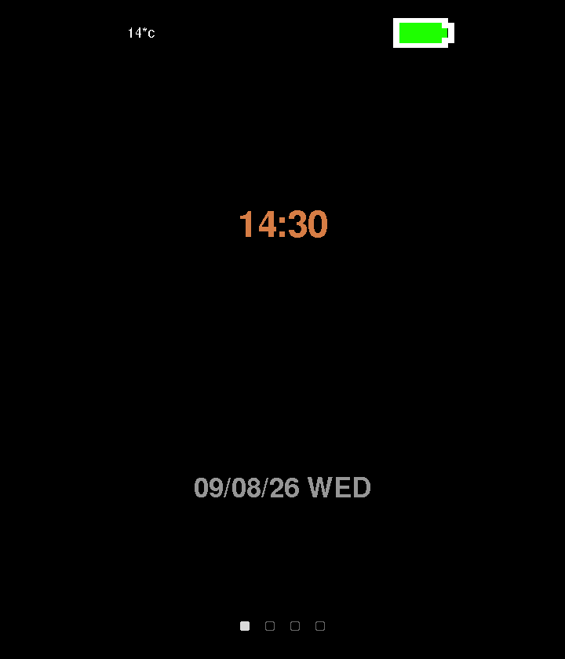 | **Watch face** - has digital and analogue variants. The analogue hands are drawn as quads on the same surface primitive used by apps. Shows the time, day of the week and date. |
| 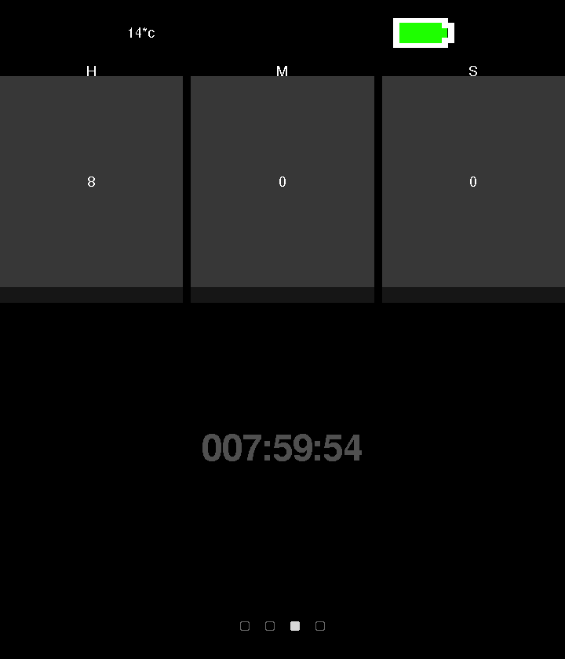          | **Timer** - three spin boxes for hours, minutes and seconds. Button 2 moves between fields, the crown adjusts the value, pressing the crown starts and pauses the timer.        |
| 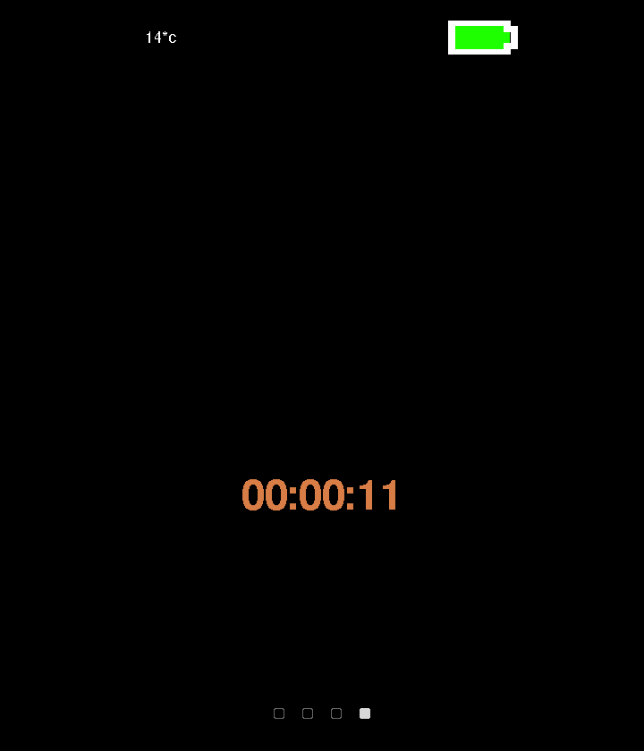  | **Stopwatch** - same interaction model, counting up rather than down.                                                                                                           |
| 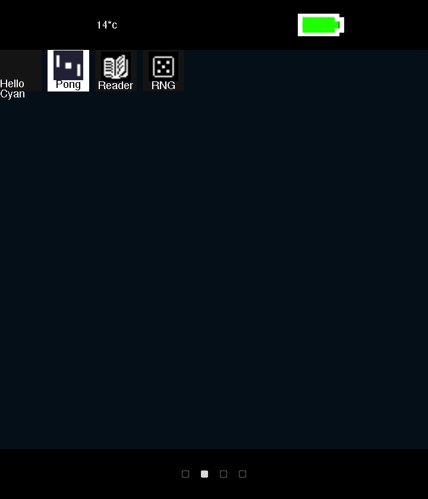       | **App catalogue** - displays a list of apps found on the SD card in rows and launches them.                                                                                     |
| 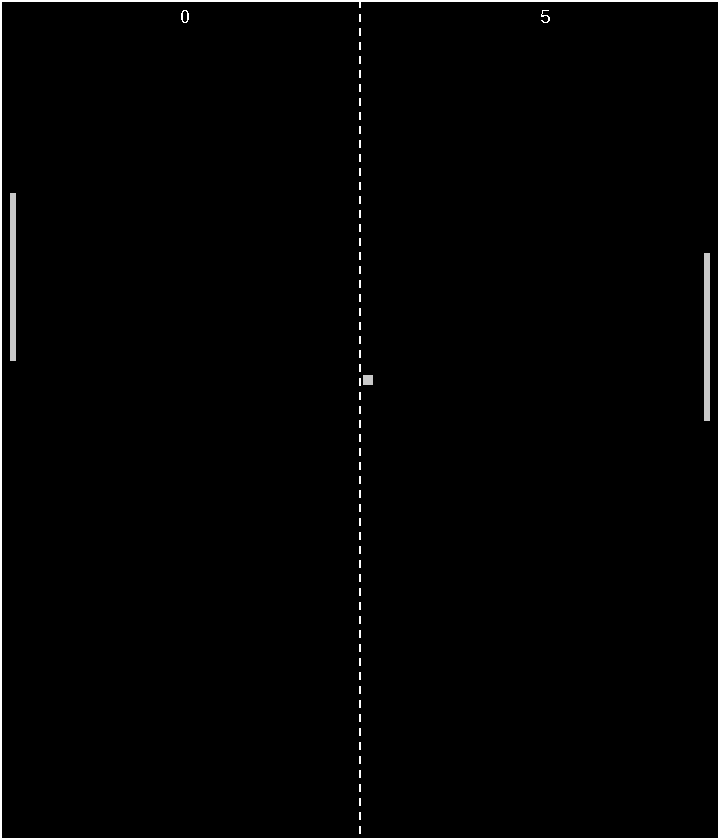         | **Pong** - a demo app written entirely in Lua, using a bespoke app API.                                                                                                         |
## Hardware
|                                                        | Function                      | Part                                                                                     | Interface    | Notes                                                                                                                                    |
| ------------------------------------------------------ | ------------------------------ | ----------------------------------------------------------------------------------------- | ------------ | ------------------------------------------------------------------------------------------------------------------------------------------ |
| 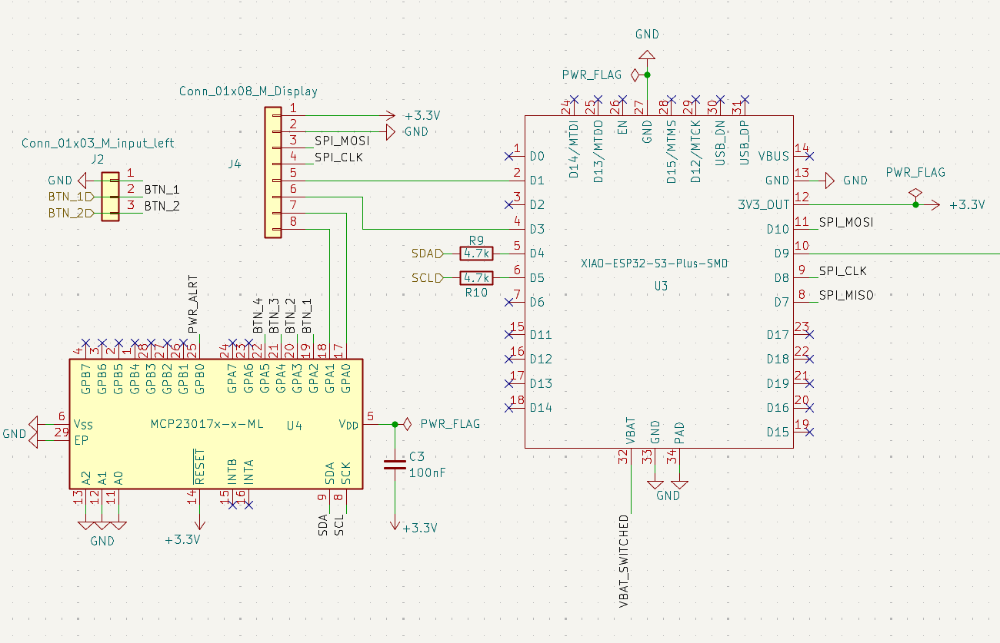                   | MCU                           | Seeed XIAO ESP32-S3 Plus                                                                 | ---          | 240 MHz dual core, 8 MB PSRAM, 16 MB flash, WiFi + BLE 5.0, 14 µA deep sleep, integrated LiPo charging                                   |
|   | Display                       | 1.69” LCD, ST7789V2                                                                      | SPI          | - 240x280 pixel resolution - 39x31.5mm                                                                                                |
| 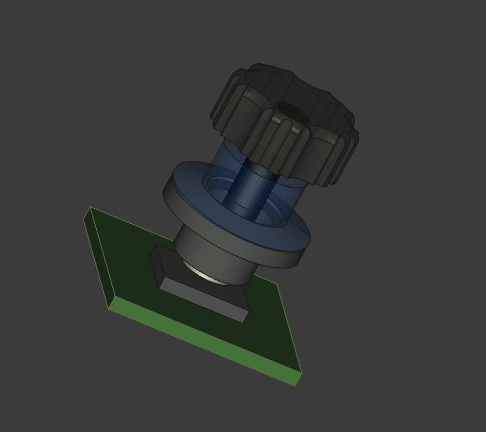          | Crown dial                    | MT6701 magnetic encoder + dipole magnet. Annular Belleville popper for tactile feedback. | I2C          |                                                                                                                                          |
|         | GPIO expansion                | MCP23017                                                                                 | I2C          | Frees ESP32 pins for the crown by moving the display RST and BL lines and the buttons onto the expander.                                 |
| 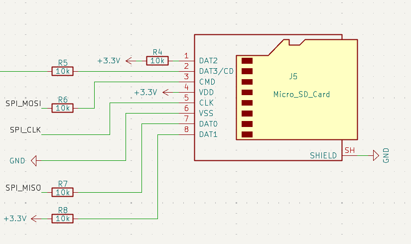               | Storage                       | MicroSD socket                                                                           | SPI          | 10 kΩ pull-ups on CS, MOSI, DAT1, DAT2 and MISO;  33 Ω series resistor on VCC to avoid the MCU browning out when the card is inserted |
| 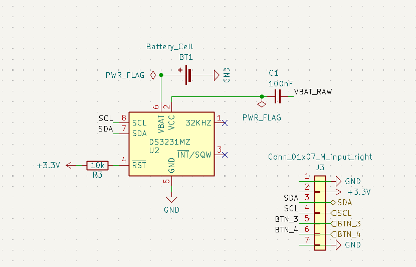                   | Real-time clock & Temperature | DS3231MZ                                                                                 | I2C          | Keeps time across power loss without a WiFi round trip. Source of ambient temperature                                                 |
| 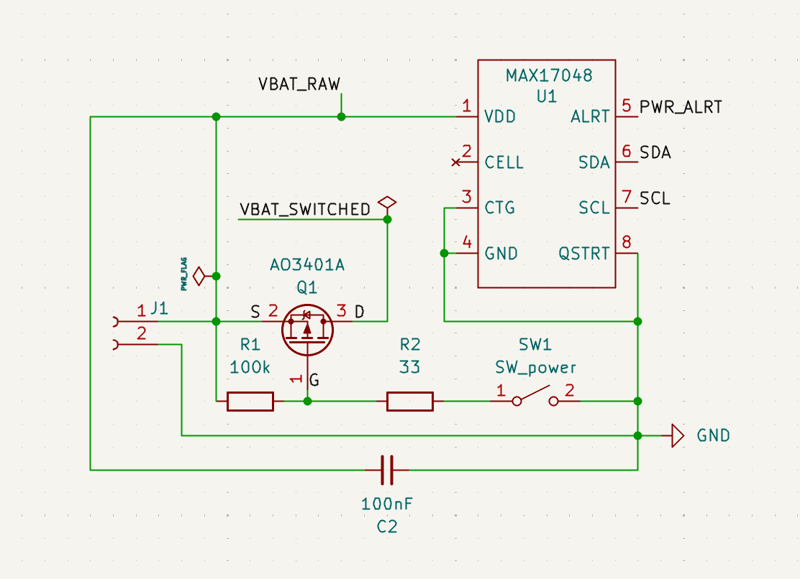         | Battery gauge                 | MAX17048                                                                                 | I2C          |                                                                                                                                          |
| 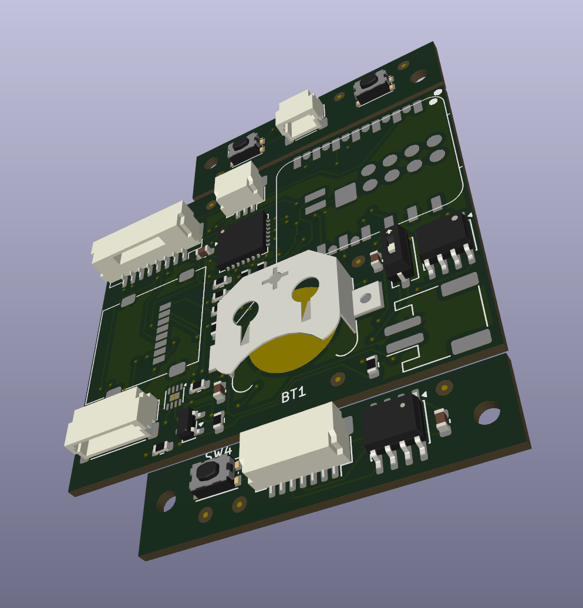                  | Battery                       | 3.7V 500mAh LiPo                                                                         | ---          | JST-PH Connector                                                                                                                         |
| 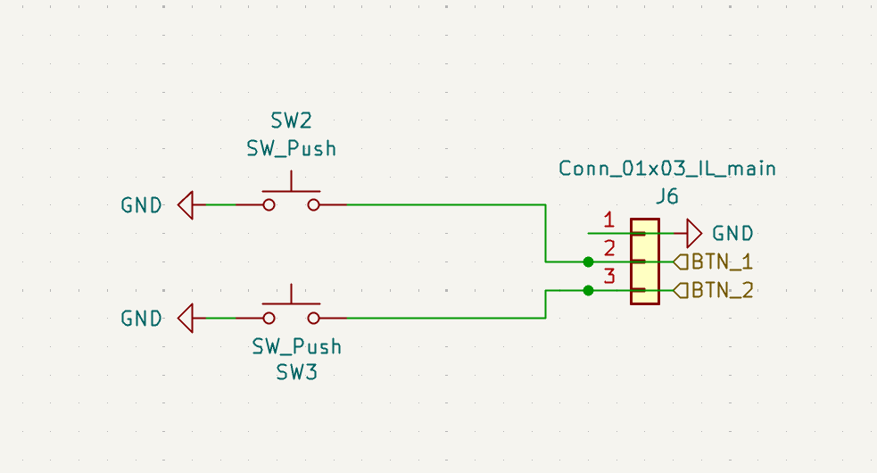               | Buttons                       | 3x tactile switch                                                                        | via MCP23017 | Buttons 1 and 2 on the left; button 4 and the crown on the right.                                                                        |

## Software

The software follows a strict naming convention for all source code for the firmware and CyanOS to keep .

| For           | Naming Convention      |
| ------------- | ---------------------- |
| **types**     | `PascalCase`           |
| **fields**    | `camelCase`            |
| **functions** | `snake_case`           |
| **constants** | `SCREAMING_SNAKE_CASE` |

`design/` holds the KiCad schematic and PCB, a FreeCAD case, component datasheets, and BOM spreadsheets for the hardware.

New public symbols should also take a `cyan_*` prefix. Styling is defined in `.clang-format` (stored at root).

Tests live under `test/`:
- `test/test_cyan_shell/` - Unity-style unit test for the shell command parser.
- `test/test_cyan_shell_repl/` - a Python-driven interactive REPL test, run via `pio test -e shell_repl`.

**PlatformIO Environments**

| Environment         | Hardware Target          | Notes                                                                                                                  |
| -------------------- | -------------------------- | -------------------------------------------------------------------------------------------------------------------- |
| `native`             | Windows PC                | uses SDL3 for window handling and rendering; this environment is used for development and iteration without hardware. |
| `esp32c3`            | Seeed XIAO ESP32-C3       | earlier hardware target, watch-face tab only.                                                    " > README.md
